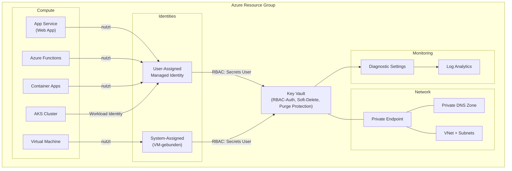

# Secure Secrets Management & Identity Integration in Azure

[](#) [](LICENSE)

> **"Sicherheit, die funktioniert: Ihre Geheimnisse sind sicher und nur fuer Ihre Anwendungen zugaenglich."**

## Was ist das?

Dieses Repository stellt eine produktionsreife Azure Key Vault Infrastruktur mit Managed Identity Integration bereit -- vollstaendig als Infrastructure as Code (Bicep). Es demonstriert, wie Azure-Services sich ohne Passwoerter am Key Vault authentifizieren koennen.

## Warum Key Vault + Managed Identity?

**Das Problem**: Passwörter, Connection Strings und API-Keys landen in Konfigurationsdateien, Umgebungsvariablen oder sogar im Quellcode. Auditoren finden sie, Rotationen sind manuell und fehleranfaellig.

**Die Lösung**: Azure Key Vault speichert alle Secrets zentral und verschluesselt. Managed Identities ermoeglichen Anwendungen den Zugriff ohne jegliche Credentials im Code. Azure uebernimmt das Credential-Management vollstaendig.

## Architektur



## Voraussetzungen

- Azure Subscription mit Berechtigungen fuer Key Vault und Identity-Erstellung
- [Azure CLI](https://learn.microsoft.com/cli/azure/install-azure-cli) mit Bicep (`az bicep install`)
- Oder: Dieses Repository im Dev Container oeffnen (alle Tools vorinstalliert)

## Quick Start

```bash
# 1. Anmelden
az login

# 2. Validieren (what-if)
./scripts/validate.sh dev

# 3. Deployen
./scripts/deploy.sh dev

# 4. Test-Secret erstellen
az keyvault secret set --vault-name kv-kvmi-dev --name test-secret --value "Hello from Key Vault!"

# 5. Aufraeumen
./scripts/teardown.sh dev
```

## Repository-Struktur

```
infra/                      Bicep Infrastructure as Code
  bicepconfig.json          Linter- und Formatting-Konfiguration
  main.bicep                Root-Orchestrierung (Einstiegspunkt)
  modules/                  Wiederverwendbare Bicep-Module
    keyvault/               Key Vault mit Security Best Practices
    rbac/                   RBAC Role Assignments
    identity/               User-Assigned Managed Identity
    webapp/                 App Service + Plan
    networking/             VNet, Private Endpoint, DNS Zone
    functions/              Azure Functions
    vm/                     Virtual Machine
    container-apps/         Container Apps
    aks/                    Azure Kubernetes Service
    monitoring/             Log Analytics, Diagnostic Settings
    automation/             Secret Rotation
  environments/             Parameter-Dateien pro Umgebung
    dev.bicepparam
    staging.bicepparam
    prod.bicepparam
examples/                   Beispiel-Anwendungen
  webapp-python/            Flask-App mit Key Vault Integration
  function-python/          Azure Function mit Key Vault Integration
scripts/                    Deployment- und Hilfs-Skripte
docs/                       Detaillierte Dokumentation
```

## Implementierungs-Phasen

| Phase | Inhalt |
|-------|--------|
| 1 | Projekt-Foundation (Struktur, Linter, README) |
| 2 | Core Key Vault Modul + RBAC + Deploy-Skripte |
| 3 | Managed Identity + Web App |
| 4 | Network Security (Private Endpoint, DNS) |
| 5 | Azure Functions |
| 6 | VM Integration |
| 7 | Container Apps + AKS |
| 8 | Monitoring + Secret Rotation |
| 9 | CI/CD (GitHub Actions, Submodule-faehig) |
| 10 | Dokumentation |

## Design-Entscheidungen

| Entscheidung | Wahl | Begruendung |
|-------------|------|-------------|
| Autorisierung | RBAC (nicht Access Policies) | Granulares Scoping, Azure-weit konsistent, Microsoft-Empfehlung |
| Identity-Typ | User-Assigned (primaer) | Wiederverwendbar, unabhaengiger Lifecycle, vorab provisionierbar |
| Parameter-Format | `.bicepparam` | Native Bicep-Format, Compile-Time-Validierung |
| Region | `germanywestcentral` | DSGVO-konform (Frankfurt), geringe Latenz fuer DE |
| Key Vault SKU | Standard | Kein HSM noetig, Premium waere 4x teurer |

## Sicherheit

Sicherheitsprobleme bitte ueber [SECURITY.md](SECURITY.md) melden.

## Lizenz

[MIT](LICENSE) -- aitimatic GmbH
