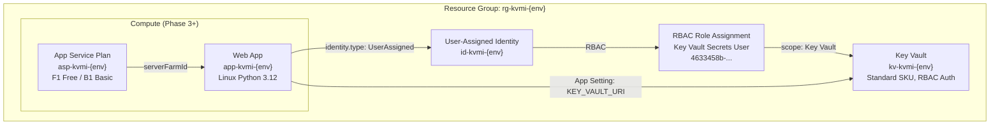
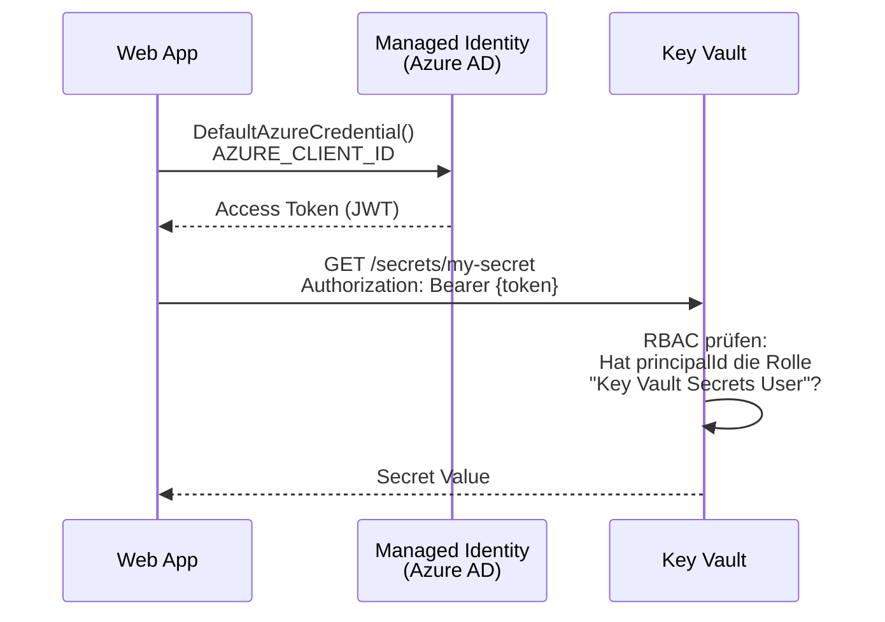
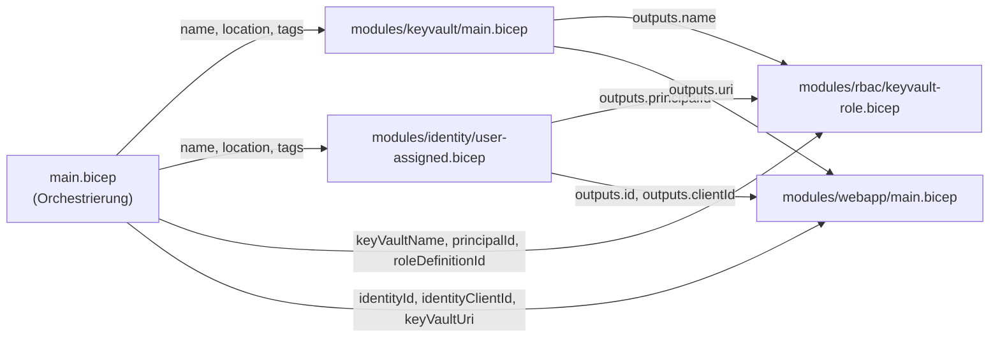
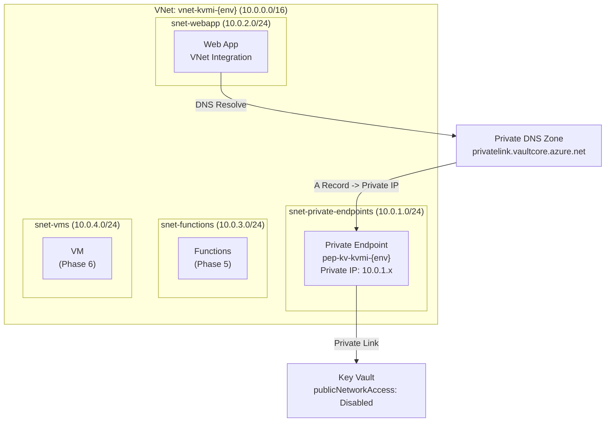

# Architektur: Key Vault + Managed Identity

## Überblick

Das System besteht aus drei Kernkomponenten:

1. **Azure Key Vault** -- Zentraler Secret Store (RBAC-autorisiert)
2. **User-Assigned Managed Identity** -- Passwordlose Authentifizierung
3. **Compute-Ressourcen** -- Web App, Functions, VM, etc. die auf Secrets zugreifen

## Komponenten-Diagramm



## Authentifizierungs-Flow



**Wichtig**: Der Access Token ist kurzlebig (~24h) und wird automatisch erneuert. Die App sieht nie ein Passwort.

## Bicep Module und ihre Beziehungen



## Naming Convention

Pattern: `{abbreviation}-{project}-{environment}`

| Ressource | Abkürzung | Beispiel Dev | Beispiel Prod |
|-----------|-----------|-------------|--------------|
| Resource Group | `rg` | `rg-kvmi-dev` | `rg-kvmi-prod` |
| Key Vault | `kv` | `kv-kvmi-dev` | `kv-kvmi-prod` |
| Managed Identity | `id` | `id-kvmi-dev` | `id-kvmi-prod` |
| App Service Plan | `asp` | `asp-kvmi-dev` | `asp-kvmi-prod` |
| Web App | `app` | `app-kvmi-dev` | `app-kvmi-prod` |
| VNet | `vnet` | `vnet-kvmi-dev` | `vnet-kvmi-prod` |
| Private Endpoint | `pep` | `pep-kv-kvmi-dev` | `pep-kv-kvmi-prod` |

Quelle: [Azure Naming Conventions](https://learn.microsoft.com/azure/cloud-adoption-framework/ready/azure-best-practices/resource-naming)

## Security Design

### RBAC statt Access Policies

| Aspekt | Access Policies (Legacy) | RBAC (unsere Wahl) |
|--------|-------------------------|-------------------|
| Scope | Nur Vault-Ebene | Vault, Secret, Key, Certificate |
| Konsistenz | Nur Key Vault | Azure-weit (Storage, Compute, etc.) |
| Vererbung | Nein | Ja (RG -> Vault -> Secret) |
| Empfehlung | Backward Compatibility | Microsoft Best Practice |

### Key Vault Security Features

| Feature | Einstellung | Warum |
|---------|------------|-------|
| RBAC Authorization | `true` | Granulare Zugriffskontrolle |
| Soft-Delete | `true` (90 Tage) | Schutz vor versehentlichem Löschen |
| Purge Protection | `true` | Verhindert endgültiges Löschen während Retention |
| Network ACLs Default | `Deny` | Kein Zugriff ohne explizite Regel |
| Network ACLs Bypass | `AzureServices` | Azure-interne Dienste können zugreifen |
| Public Network Access | `Enabled` (Phase 2-3), `Disabled` (Phase 4+) | Wird mit Private Endpoint abgeschaltet |

### Principle of Least Privilege

Jede Identity bekommt nur die minimale Berechtigung:

| Identity | Rolle | GUID | Erlaubt |
|----------|-------|------|---------|
| Web App Identity | Key Vault Secrets User | `4633458b-...` | Nur Secret-Werte lesen |
| (Nicht vergeben) | Key Vault Secrets Officer | `b86a8fe4-...` | Secrets erstellen/ändern/löschen |
| (Nicht vergeben) | Key Vault Administrator | `00482a5a-...` | Volle Verwaltung |

## Feature Flags

Deployments werden über Parameter gesteuert:

| Flag | Default | Aktiviert in |
|------|---------|-------------|
| `deployWebApp` | `false` | Phase 3 |
| `deployNetworking` | `false` | Phase 4 |
| `deployFunctions` | `false` | Phase 5 (geplant) |
| `deployVm` | `false` | Phase 6 (geplant) |

In `dev.bicepparam`:
```bicep
param deployWebApp = true  // Phase 3 aktivieren
```

## Netzwerk-Topologie (Phase 4)



Wenn `deployNetworking = true`:
- Key Vault `publicNetworkAccess` wird auf `Disabled` gesetzt
- Traffic läuft nur noch über den Private Endpoint im VNet
- DNS-Auflösung via Private DNS Zone: `kv-kvmi-dev.vault.azure.net` -> Private IP

## Environments

| Environment | Region | Key Vault SKU | App Service SKU | Networking |
|------------|--------|--------------|-----------------|-----------|
| dev | germanywestcentral | Standard | F1 (Free) | Optional |
| staging | germanywestcentral | Standard | B1 (Basic) | An |
| prod | germanywestcentral | Standard/Premium | S1 (Standard) | An |
